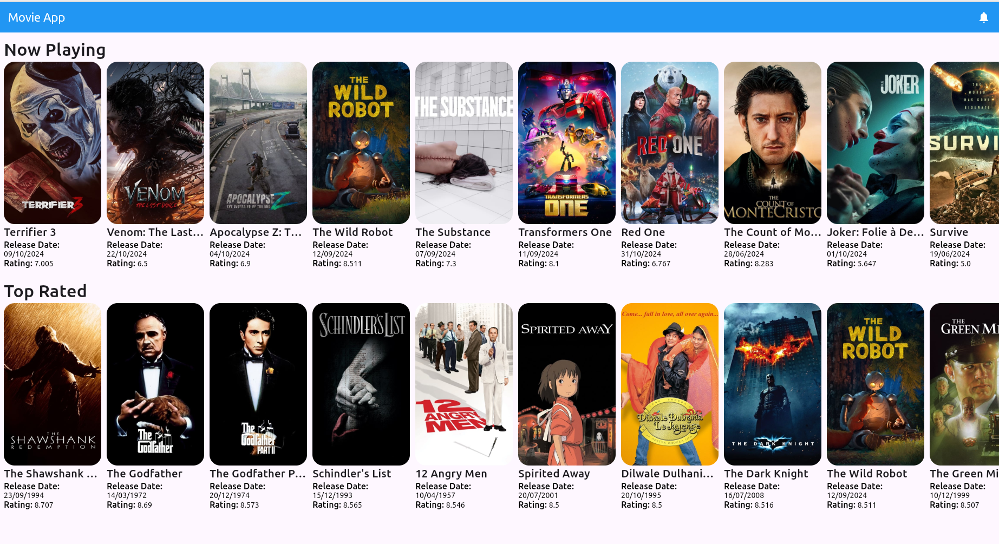

# [Movie Flutter](https://github.com/rahulrajdahal/movie-flutter). Browse the movies your love

Browse through movies.

- Now playing movies
- Top rated movies.
- Get all the details about the movie.

## Preview

<a href="https://github.com/rahulrajdahal/movie-flutter">

</a>




## 🏗 Development Guide

### 1. clone the repository

```sh
git clone https://github.com/rahulrajdahal/movie-flutter.git
```

### 2. Install Dependencies

#### npm

```sh
cd movie_flutter && flutter pub get
```

### 3. Connect to your API 💾

Create a copy of **.env** file and update the key value pairs.

### 4. Run in debug mode

```sh
flutter run --debug
```

#### OR

### Run in Production

```sh
flutter run --release
```

## 🚀 Project Structure

Inside of project [movie_flutter](https://github.com/rahulrajdahal/movie-flutter), you'll see the following folders and files:

```text
/
├── screenshots/
|   └── screenshot.jpg
├── lib/
|   ├── models/
│   │   └── model.dart
|   ├── pages/
│   │   └── page.dart
|   ├── widgets/
│   │   └── widget.dart
│   ├── main.dart
│   └── services.dart
├── .env.example
└── pubspec.yaml
```
